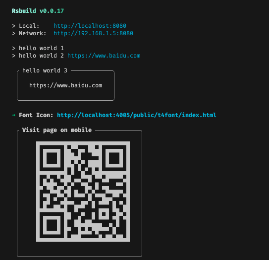

# rsbuild-plugin-print

[](https://www.npmjs.com/package/rsbuild-plugin-print)

## Install

```bash
npm i rsbuild-plugin-print -D
```

<details>
<summary>Rsbuild</summary><br>

```ts
// rsbuild.config.ts
import { pluginPrint } from 'rsbuild-plugin-print';

export default defineConfig({
  plugins: [
    pluginPrint({
      /* options */
    }),
  ],
});
```

Example: [`playground/`](./playground/)

<br></details>

## Options

```ts
import type * as kolorist from 'kolorist';

import type { Options as BoxenOptions } from 'boxen';

type Kolorist = Omit<typeof kolorist, 'SupportLevel' | 'options'>;

export type MessageValue = Omit<BoxenOptions, 'borderStyle'> & {
  text: string;
  url?: string;
} & {
  borderStyle?: BoxenOptions['borderStyle'] | 'none';
};

type Message =
  | string
  | MessageValue
  | ((
      kolorist: Kolorist,
    ) => string | MessageValue | Promise<string | MessageValue | void>);

export interface IPluginOptions {
  info?: Message[];
  hostQrcode?: boolean;
}
```

## Demo


